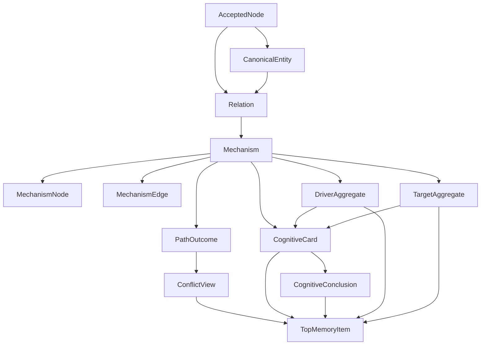

# VariX Memory v2 关系优先认知系统设计（终版草案）

## 1. Goal

VariX Memory v2 不是文章归档系统，也不是 topic 聚类系统，而是一个**以财经传导关系为核心的认知数据库**。

系统需要同时满足以下目标：

1. **底层 truth 稳定**
   - 不依赖模糊的 thesis / cluster 命名
   - 不会因为“到底属于伊朗战争还是黄金”而失真
2. **能够表达复杂传导机制**
   - 财经分析真正有价值的是传导链
   - 机制可以很长、可分叉、可汇合、可竞争
3. **支持双视角浏览**
   - 按影响者看：这个 driver 影响了什么
   - 按被影响者看：这个 target 被什么影响
4. **支持顶层抽象，但不瞎编**
   - 可以给用户结论感、alpha 感
   - 必须可追溯
   - 有冲突时先展示冲突

---

## 2. Design Principles

### 2.1 CanonicalEntity is the stable anchor
系统必须先有实体锚点，关系与聚合都围绕 canonical entity 展开，而不是围绕裸字符串。

### 2.2 Relation is the truth boundary
Memory v2 的底层关系 truth boundary 不是 thesis，也不是 cluster，而是 **Relation**。

### 2.3 Mechanism is the high-information layer
driver 和 target 相对有限；真正复杂、真正值钱的是 **Mechanism**。

### 2.4 Aggregates are indexes, not truth
`DriverAggregate` 和 `TargetAggregate` 是上层浏览索引，不是新的真相层。

### 2.5 Derived views stay derived
`CognitiveCard`、`CognitiveConclusion`、`ConflictView` 都是投影层，不直接承担 truth。

### 2.6 Conflict blocks abstraction
如果同一关系内部存在无法消解的矛盾，系统必须停止抽象，优先展示 conflict。

### 2.7 Traceability is mandatory
任何卡片、结论、冲突，都必须能够追溯回：
- accepted nodes
- canonical entities
- relations
- mechanisms
- source refs

---

## 3. Scope

### In Scope
- accepted memory 之上的 relation-first 组织层
- canonical entity 解析
- relation 构建与生命周期管理
- mechanism 构建
- driver / target 双聚合
- derived cards / conclusions / conflicts
- 第一层统一 TopMemoryItem
- 和现有 v1 cluster-first 并存迁移

### Out of Scope
- 自动替用户解决冲突
- 自动投资建议
- 多 driver / 多 target 作为底层 truth object
- 全自动、无限制 canonicalization
- 复杂推荐排序系统

---

## 4. Core Object Model

### 4.1 Accepted Truth Layer

这是现有底盘，保留不动。

**Objects**
- `AcceptedNode`
- `AcceptanceEvent`
- `OrganizationJob`

**Responsibility**
- 保存用户接受了哪些 compile node
- 作为所有高层结构的最终追溯来源

**Rule**
- 此层不承担产品抽象
- 此层只承担 truth substrate 角色

---

### 4.2 Canonical Entity Layer

这是所有关系与聚合的稳定锚点层。

#### Object: `CanonicalEntity`

一个 `CanonicalEntity` 表示系统内部的标准化认知对象。

它既可以是影响者，也可以是被影响者，也可以两者兼具。

**Examples**
- 伊朗战争
- 黄金
- 石油
- 美元流动性
- 实际利率

**Why unified**
使用统一 `CanonicalEntity`，而不是拆成 `DriverEntity` / `TargetEntity` 两套对象，原因是很多财经对象会双向扮演角色：
- 油价既可能被影响，也可能影响别的资产
- 美元流动性既可能是结果，也可能是驱动
- 实际利率既可能作为 target，也可能作为 driver

**Required fields**
- `entity_id`
- `entity_type` (`driver` | `target` | `both`)
- `canonical_name`
- `aliases`
- `status`
- `merge_history`
- `split_history`
- `created_at`
- `updated_at`

**Hard rules**
1. aggregate 永远聚合 `CanonicalEntity`，不聚合裸字符串
2. relation 两端永远指向 canonical entity
3. alias / merge / split 必须落在这个对象层，而不是散落在 relation 层

---

### 4.3 Relation Layer

这是底层关系 truth boundary。

#### Object: `Relation`

一个 `Relation` 表示一条稳定的“谁影响谁”的关系边界。

它回答的是：

> **某个 canonical driver 是否会影响某个 canonical target？**

**Examples**
- 伊朗战争 -> 黄金
- 伊朗战争 -> 石油
- 高利率 -> 私募信贷

**Important clarification**
`Relation` 本身**不承诺单一方向**。

原因是同一个 driver -> target 内部，可能存在方向相反的 competing mechanisms：
- 伊朗战争 -> 黄金
  - 避险需求上升 -> 黄金上涨
  - 中东国家卖黄金换美元 -> 黄金下跌

所以：
- `Relation` 只承诺：**存在可追溯影响关系**
- 方向应该落在 mechanism path outcome 层

**Required fields**
- `relation_id`
- `driver_entity_id`
- `target_entity_id`
- `status`
- `retired_at`
- `superseded_by_relation_id`
- `merge_history`
- `split_history`
- `lifecycle_reason`
- `created_at`
- `updated_at`

**Hard rules**
1. 一个 `Relation` 只能有一个 driver entity
2. 一个 `Relation` 只能有一个 target entity
3. 不允许把多个 driver 或多个 target 捆绑成一个底层 truth object
4. `Relation` 不直接存最终 polarity
5. `Relation` 必须支持 merge / split / retire / supersede 等生命周期操作

---

### 4.4 Mechanism Layer

这是关系的正文层，也是系统的高信息密度层。

#### Object: `Mechanism`

`Mechanism` 描述一条 relation 到底**如何传导**。

如果说：
- `Relation` 是标题
- 那 `Mechanism` 就是正文

**Core idea**
- `Relation` 只回答：谁影响谁
- `Mechanism` 回答：怎么影响、经过哪些中间机制、哪些路径竞争、哪些条件成立、当前证据如何分布

**Example**

针对 `伊朗战争 -> 黄金`：

路径 A：
- 伊朗战争
- 避险需求上升
- 黄金上涨

路径 B：
- 伊朗战争
- 中东国家货币暴跌
- 中东国家卖黄金换美元稳汇率
- 黄金下跌

这两个 competing paths 都属于同一个 `Relation`，但由 `Mechanism` 承载。

#### Object split
为避免一个超大 JSON blob 混合图结构、证据追溯和元数据，Mechanism 逻辑上拆成四类对象：

##### `Mechanism`
头对象，承载元数据。

**Required fields**
- `mechanism_id`
- `relation_id`
- `as_of`
- `valid_from`
- `valid_to`
- `confidence`
- `status`
- `source_refs`
- `traceability_status`
- `created_at`
- `updated_at`

##### `MechanismNode`
机制图节点。

**Required fields**
- `mechanism_node_id`
- `mechanism_id`
- `node_type`
- `label`
- `backing_accepted_node_ids`

**Node types**
- `driver`
- `macro_event`
- `policy_state`
- `liquidity_state`
- `market_behavior`
- `asset_flow`
- `condition`
- `boundary`
- `target_effect`

##### `MechanismEdge`
机制图边。

**Required fields**
- `mechanism_edge_id`
- `mechanism_id`
- `from_node_id`
- `to_node_id`
- `edge_type`

**Edge types**
- `causes`
- `amplifies`
- `suppresses`
- `transmits`
- `requires`
- `presets`
- `conflicts_with`

##### `PathOutcome`
机制路径结果对象。

**Required fields**
- `path_outcome_id`
- `mechanism_id`
- `node_path`
- `outcome_polarity`
- `outcome_label`
- `condition_scope`
- `confidence`

**Hard rules**
1. `Mechanism` 是 relation 的细节正文层，不是新的 truth boundary
2. 同一 relation 可有多个 mechanism records（随时间演化）
3. direction / polarity 下沉到 `PathOutcome` 层，不放在 relation 层
4. mechanism 中每个关键节点都必须可追溯
5. 不存 `primary_path` / `alternative_path` 字段，所有 path 平等存储，展示层再排序

---

### 4.5 Aggregate Layer

上层浏览层，不是真相层。

#### 4.5.1 `DriverAggregate`

按影响者聚合。

**Question it answers**
> 这个 driver 正在影响什么？

**Example**
`伊朗战争`
- -> 黄金
- -> 石油
- -> 美股
- -> 美元

**Required fields**
- `aggregate_id`
- `driver_entity_id`
- `relation_ids`
- `target_entity_ids`
- `mechanism_labels`
- `coverage_score`
- `conflict_count`
- `active_conclusion_ids`
- `traceability_status`
- `as_of`

#### 4.5.2 `TargetAggregate`

按被影响者聚合。

**Question it answers**
> 这个 target 正在被什么影响？

**Example**
`黄金`
- <- 伊朗战争
- <- 实际利率
- <- 美元流动性
- <- 中东货币危机导致的被迫抛售

**Required fields**
- `aggregate_id`
- `target_entity_id`
- `relation_ids`
- `driver_entity_ids`
- `mechanism_labels`
- `coverage_score`
- `conflict_count`
- `active_conclusion_ids`
- `traceability_status`
- `as_of`

**Aggregate rules**
1. aggregate 只从 relation + mechanism 派生
2. aggregate 不直接成为底层 truth
3. aggregate 必须带 `as_of`

---

### 4.6 Derived View Layer

这些对象全部是产品层投影。

#### 4.6.1 `ConflictView`

对 unresolved contradiction 的结构化展示。

**Scope**
- relation
- driver aggregate
- target aggregate

**Required fields**
- `conflict_id`
- `scope_type`
- `scope_id`
- `left_path_outcome_ids`
- `right_path_outcome_ids`
- `conflict_reason`
- `conflict_topic`
- `status`
- `as_of`
- `traceability_map`

**Rule**
真正冲突的是 path，不是整个 mechanism，所以 conflict 应该引用 `PathOutcome`。

#### 4.6.2 `CognitiveCard`

把 relation + mechanism + aggregate 翻译成可读认知卡。

**Card granularity**
默认一张主卡对应一个 **`(relation_id, as_of)`**。

这意味着：
- card 的 identity 以 relation 为主
- 当前有效 mechanism 作为内容
- competing paths 作为卡内结构出现
- 不按每条 path 单独出一张默认卡

**Required fields**
- `card_id`
- `relation_id`
- `as_of`
- `title`
- `summary`
- `mechanism_chain`
- `key_evidence`
- `conditions`
- `predictions`
- `source_refs`
- `confidence_label`
- `trace_entry`

#### 4.6.3 `CognitiveConclusion`

从 grounded structure 中抽出来的高阶判断。

**Required fields**
- `conclusion_id`
- `source_type`
- `source_id`
- `headline`
- `subheadline`
- `backing_card_ids`
- `core_claims`
- `traceability_status`
- `blocked_by_conflict`
- `as_of`

**Abstraction gate**
只有满足以下条件才能生成：

**硬门（规则校验）**
1. `conflict_free == true`
2. `traceability_complete == true`
3. `backing_card_count >= N`
4. `evidence_node_count >= M`
5. `mechanism_path_count >= 1`
6. 核心 canonical entities 已解析

**软门（LLM judge）**
由 judge model 打分并持久化：
- `non_generic_score`
- `summary_quality_score`
- `headline_sharpness_score`
- `novelty_score`
- `judge_passed`
- `judge_model`
- `judge_prompt_version`
- `judged_at`

规则：
- 硬门不过，直接不能出 conclusion
- 硬门过了，再让 soft judge 决定文案是否值得展示
- soft judge 必须可复现、可 A/B、可回溯

#### 4.6.4 `TopMemoryItem`

用户第一层看到的统一壳。

**Item types**
- `driver_aggregate`
- `target_aggregate`
- `card`
- `conclusion`
- `conflict`

---

## 5. Temporal Model

财经关系不是静态命题，而是随时间演化的。

### Stable identity layer
- `CanonicalEntity`
- `Relation`

### Time-varying content layer
- `Mechanism`
- `DriverAggregate`
- `TargetAggregate`
- `ConflictView`
- `CognitiveCard`
- `CognitiveConclusion`

### Rule
- 不删除旧 mechanism
- 旧 mechanism 转为历史记录
- 查询默认使用当前 `as_of`
- 系统允许同一 relation 在不同时间切片有不同 mechanism 主导

---

## 6. Full Pipeline

### Phase 1: Single-content understanding
```text
Raw Content
-> Compile
-> Graph Nodes / Edges
-> Verifier
-> Persisted Compile Output
```

### Phase 2: User acceptance
```text
Persisted Compile Output
-> selected node ids
-> AcceptedNode
-> AcceptanceEvent
-> OrganizationJob
```

### Phase 3: Relation construction
```text
AcceptedNodes
-> local relation candidate extraction
-> CanonicalEntity resolution
-> Relation match / create
```

### Phase 4: Mechanism construction
```text
Relation + AcceptedNodes
-> mechanism-step discovery
-> path stitching
-> branch / merge detection
-> competing mechanism detection
-> Mechanism
```

### Phase 5: Conflict detection
```text
Mechanism
-> relation-level conflict detection
-> aggregate-level conflict detection
-> ConflictView
```

### Phase 6: Dual aggregation
```text
Relation + Mechanism
-> group by driver -> DriverAggregate

Relation + Mechanism
-> group by target -> TargetAggregate
```

### Phase 7: Derived projections
```text
Mechanism + Aggregates + ConflictView
-> CognitiveCard
-> CognitiveConclusion
-> TopMemoryItem
```

---

## 7. Conflict Rules

### 7.1 Conflict is not a bug
冲突不是异常，而是认知系统必须显式处理的对象。

### 7.2 Conflict levels

**Level 1: relation-level conflict**
- 同一 driver -> target 内出现 competing mechanisms，且 outcome polarity 相反

**Level 2: driver-aggregate conflict**
- 同一 driver 影响多个对象的解释彼此冲突

**Level 3: target-aggregate conflict**
- 同一 target 受到多个 driver 驱动，但方向或解释彼此冲突

### 7.3 Detection stages

**Stage A：relation 内部冲突检测**
- 在 mechanism build 后执行
- 检查同一 relation 内部是否存在 competing paths

**Stage B：aggregate 层冲突检测**
- 在 driver / target aggregate build 后执行
- 检查跨 relation 的冲突

### 7.4 Hard conflict candidate rule
只有在以下情况成立时，才进入冲突候选：
1. 同一 `driver_entity + target_entity`
2. 时间窗口重叠
3. 条件范围重叠
4. path outcome polarity 相反
5. 且无法被条件差异解释

### 7.5 Resolution policy
1. **能条件化就条件化**
   - 如果只是不同条件路径，不算真正冲突
2. **不能条件化就冲突展示**
   - 停止抽象
3. **系统不替用户站队**
   - 系统负责结构化冲突，不负责替用户裁决

### 7.6 Lifecycle
`ConflictView` 不是底层 truth，而是当前 `as_of` 下的派生视图。

因此：
- 新 accepted nodes 进入后自动重评估
- 旧 conflict 可以消失、分裂、降级

---

## 8. Canonicalization Rules

### 8.1 Driver canonicalization
Driver 往往带 alias：
- 伊朗战争
- 伊以冲突
- 中东战争升级

**Policy**
- 保留原文 label
- 建立 canonical entity
- 支持 alias map
- 支持 unresolved canonicalization

### 8.2 Target canonicalization
Target 相对更稳定，且更重要，因为它是主要浏览入口。

**Typical targets**
- 黄金
- 石油
- 美股
- 美债
- 美元
- BTC
- 私募信贷
- AI SaaS

**Policy**
- target 做更强标准化
- 严格控制过度合并

---

## 9. Relation Extraction Strategy

这是整个系统最难的环节，必须分阶段做，不能只靠一句泛 prompt。

### Step 1: source-local extraction
从单篇 / 单 source accepted nodes 中提取本地 relation candidates。

目标：
- 一篇内容中可以拆出多个 driver-target 对
- 不能整篇只生成一个大 relation

### Step 2: endpoint canonicalization
把 local candidate 的两端点对齐到 `CanonicalEntity`。

输出：
- `driver_entity_id`
- `target_entity_id`

### Step 3: relation matching
按以下键尝试并入已有 `Relation`：
- `driver_entity_id`
- `target_entity_id`

### Step 4: mechanism build/update
如果命中已有 relation，则不更新 relation identity，而是：
- 补充已有 mechanism 证据
- 或创建新的 mechanism 记录

### Update policy
**补充已有 mechanism**
当：
- 只是补充证据
- 或补充相同机制链的细节

**新建 mechanism**
当：
- 时间 regime 改变
- 核心 mechanism 明显变化
- path outcome 发生重大分化
- 旧 mechanism 已经过期

---

## 10. Deletion / Retraction Semantics

这是一个必须显式说明的语义层。

### Current strategy
采用：
> **soft delete / tombstone + 下次 organization job 全链重评估**

### Trigger cases
- 用户 unaccept 某个 accepted node
- 某 source 被标记为 false / retracted
- 某上游 compile / verify 结果被撤销

### Re-evaluation scope
触发后重新评估：
- `Mechanism`
- `PathOutcome`
- `ConflictView`
- `CognitiveCard`
- `CognitiveConclusion`
- `TopMemoryItem`

### Effect rules
- 如果只是证据减少：mechanism 降级
- 如果关键 path 被抽空：path outcome 失效
- 如果整条 relation 已无支撑：relation 转 inactive / retired

### Note
MVP 不要求完整实现全部回滚语义，但文档与数据模型必须为该策略留出位置。

---

## 11. Product Surface Design

### 11.1 Default feed
默认 feed 推荐优先展示：
- `conclusion`
- `conflict`

原因：
- 第一层需要信息压缩和 alpha 感
- 冲突必须优先暴露

### 11.2 Navigation surfaces
系统必须并列支持：
- **By Driver**
- **By Target**

### 11.3 User mental model
- Feed：今天最值得看的认知结果
- By Driver：这件事影响了什么
- By Target：这个标的被什么影响
- Detail：这条关系是通过什么 mechanism 传导的

---

## 12. Migration Plan

### Phase 1: coexistence
- 保留 v1 `cluster-first`
- 新增 v2 `relation-first`
- accepted memory truth 不变
- compare surface 同时支持 v1 / v2

### Phase 2: presentation swap
- 第一层展示从 cluster summary 切到 `TopMemoryItem`
- cluster 降级为 debug / regression layer

### Phase 3: cluster demotion
- v2 relation-first 成为默认 mental model
- v1 仅作为兼容与调试工具存在

---

## 13. Hard Rules

1. 底层 truth boundary 必须是 `Relation`
2. `Relation` 只能有一个 driver entity 和一个 target entity
3. direction / polarity 不得放在 relation 层，必须下沉到 `PathOutcome`
4. `Mechanism` 是关系正文层，必须可追溯
5. driver / target aggregates 只能从 relation + mechanism 派生
6. derived views 不得伪装成底层 truth
7. 冲突存在时必须优先展示冲突
8. 任何 conclusion 必须先过硬门，再过软门
9. 空泛、泛化、不可追溯的抽象视为失败

---

## 14. Mermaid System Diagram



---

## 15. Final Summary

VariX Memory v2 的稳定设计是：

- **稳定锚点层：CanonicalEntity**
- **关系边界层：Relation**
- **关系正文层：Mechanism**
- **机制结构层：MechanismNode / MechanismEdge / PathOutcome**
- **双入口浏览层：DriverAggregate / TargetAggregate**
- **产品投影层：CognitiveCard / CognitiveConclusion / ConflictView**
- **统一第一层：TopMemoryItem**

一句话概括：

> **VariX Memory v2 是一个以 CanonicalEntity 为锚点、以 Relation 为关系边界、以 Mechanism 为传导正文、以 driver / target 双聚合为导航层、以卡片 / 结论 / 冲突为产品层的财经认知系统。**
